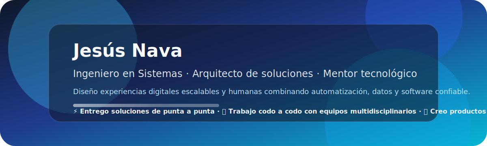
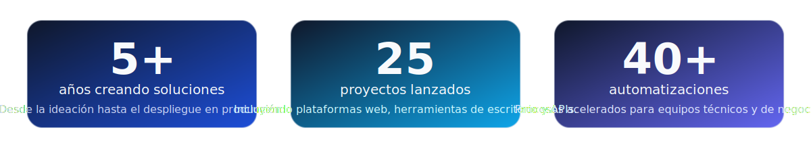

  

## ✨ En resumen
- 👨‍💻 **Ingeniero en Sistemas** especializado en crear plataformas que conectan procesos físicos y digitales.
- 🧭 **Lidero proyectos end-to-end**, desde la ideación hasta la puesta en marcha y el monitoreo de resultados.
- 🌐 **Combino automatización, IoT y desarrollo de software** para acelerar equipos de negocio y tecnología.

  

## 🚀 Propuesta de valor
| Estrategia | Ingeniería | Impacto |
| --- | --- | --- |
| 🎯 Diseños centrados en objetivos medibles y roadmaps claros para stakeholders. | 🛠️ Arquitecturas modulares con pruebas automatizadas y despliegues confiables. | 📈 Métricas compartidas que evidencian adopción, reducción de costos y tiempo de entrega. |

## 🧰 Stack principal

  
  
  
  
  
  
  
  

## 📈 Impacto medible

  

## 🏗️ Proyectos destacados

  <table>
    <tr>
      <td width="50%">
        <h3>Plataformas de automatización</h3>
        
Integraciones que orquestan APIs, limpian datos y activan flujos inteligentes para acelerar operaciones.

        
<strong>Resultado:</strong> reducción de hasta 40% en tiempos de entrega y visibilidad centralizada.

        
<a href="https://github.com/El-Nava?tab=repositories" target="_blank">Explorar entregables</a>

      </td>
      <td width="50%">
        <h3>Aplicaciones .NET de misión crítica</h3>
        
Soluciones de escritorio y web con C# y .NET, diseñadas para áreas administrativas y control industrial.

        
<strong>Resultado:</strong> dashboards accionables, trazabilidad y despliegues automatizados.

        
<a href="https://github.com/El-Nava?tab=repositories" target="_blank">Ver casos de éxito</a>

      </td>
    </tr>
    <tr>
      <td width="50%">
        <h3>Experimentos embebidos</h3>
        
Prototipos con Arduino y C/C++ que conectan sensores, controlan dispositivos y alimentan tableros en tiempo real.

        
<strong>Resultado:</strong> validaciones rápidas y transferencia de conocimiento a equipos de ingeniería.

        
<a href="https://github.com/El-Nava?tab=repositories" target="_blank">Ver prototipos</a>

      </td>
      <td width="50%">
        <h3>Playbooks de colaboración</h3>
        
Documentación clara, tableros compartidos y métricas vivas para mantener alineados a stakeholders técnicos y de negocio.

        
<strong>Resultado:</strong> comunicación transparente y decisiones respaldadas por datos.

        
<a href="https://github.com/El-Nava?tab=repositories" target="_blank">Descubrir herramientas</a>

      </td>
    </tr>
  </table>

## 🎯 Cómo puedo ayudarte
- ✅ Auditorías técnicas para identificar cuellos de botella y oportunidades de automatización.
- ✅ Diseño y desarrollo de MVPs listos para recibir feedback real de usuarios.
- ✅ Modernización de soluciones heredadas con foco en mantenibilidad y seguridad.
- ✅ Implementación de tableros y reportes que hacen visibles los indicadores clave.

## 🤝 Conecta conmigo

  
  
  
  

---

  <em>"La tecnología es la herramienta que transforma ideas en impacto."</em>

  

